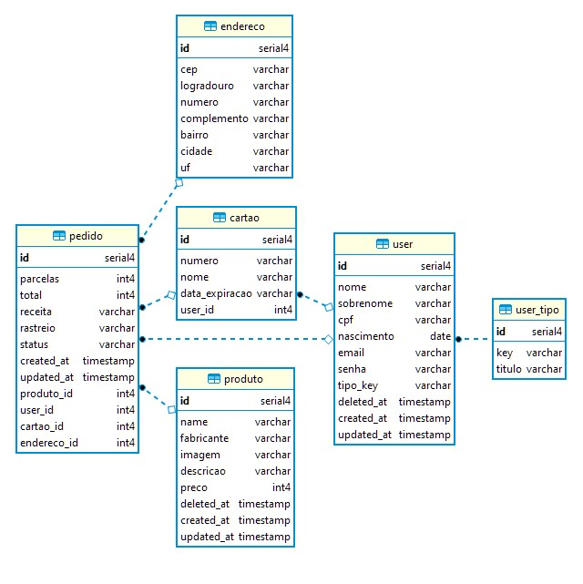

<p align="center">
    CENTRO UNIVERSITÁRIO SENAC:<br/>
    TECNOLOGIA EM SISTEMAS PARA INTERNET<br/><br/>
    PROJETO INTEGRADOR:<br/>
    CRIAÇÃO DE MINIMUM VIABLE PRODUCT
</p>

---

<p align="center">
    
</p>

---

## Alunos: 
 - Ariane Araújo Cabral de Figueiredo
 - David Santana da Silva
 - Felipe Valli
 - Gilmair Vieira Barros
 - Ignacio Javier Mourullo
 - Josué Domingues de Oliveira Neto
 - Lucas Souza Pereira 

## Tecnologias

### Protótipo
- [Figma Geral](https://www.figma.com/file/1fRZ3Q4iAgCL0llICXowcS/BrighEyes?type=design&node-id=0%3A1&mode=design&t=UBWFA8k48tu9WpsG-1)
- [Figma Fluxo Cliente](https://www.figma.com/proto/1fRZ3Q4iAgCL0llICXowcS/BrighEyes?type=design&node-id=106-63&t=mVk5yQxQyymtmcMz-1&scaling=scale-down&page-id=0%3A1&starting-point-node-id=113%3A1469&mode=design)
- [Figma Fluxo Gerente](https://www.figma.com/proto/1fRZ3Q4iAgCL0llICXowcS/BrighEyes?type=design&node-id=675-1480&t=RC8jtAscvVE57RFa-1&scaling=scale-down&page-id=675%3A1287&starting-point-node-id=675%3A1458&mode=design)
- [Figma Fluxo Editor(a)](https://www.figma.com/proto/1fRZ3Q4iAgCL0llICXowcS/BrighEyes?type=design&node-id=675-7003&t=UBWFA8k48tu9WpsG-0&scaling=scale-down&page-id=675%3A7003&starting-point-node-id=675%3A7051)

#### Backend:
- Engine [Node v18](https://nodejs.org/docs/latest-v18.x/api/)
- Package Manager: [NPM](https://www.npmjs.com/)
- Transpiler [TypeScript](https://www.typescriptlang.org/)
- Framework [Fastify](https://fastify.dev/)
- Orm [TypeOrm](https://typeorm.io/)
- Linter: [EsLint](https://eslint.org/)

#### Frontend:
- [Node v18](https://nodejs.org/docs/latest-v18.x/api/)
- Package Manager: [NPM](https://www.npmjs.com/)
- Transpiler [TypeScript](https://www.typescriptlang.org/)
- Framework [Vue3](https://vuejs.org/)
- Vue3 Component Framework [Vuetify](https://vuetifyjs.com/)
- Tooling [Vite](https://vitejs.dev/)
- Linter: [EsLint](https://eslint.org/)
- Package Manager: [Yarn](https://yarnpkg.com/)

#### Banco de Dados:
- [Postgres14](https://www.postgresql.org/)
- Diagrama de Relacionamento:

<p align="center">
    
</p>

#### Ferramental
- [Docker](https://www.docker.com/)
- Docker Image: [Linux Alpine](https://hub.docker.com/_/alpine)
- Database Client: [DBeaver](https://dbeaver.io/download/)
- Editor de Texto: [Visual Studio Code](https://code.visualstudio.com/)
- Editor Gráfico: [Figma](https://www.figma.com/)

## Instruções

#### Para iniciar
Clone este projeto atráves do comando `git clone`:

Para baixar os submódulos:
```
git submodule update --init
```
Para atualizar submóduloes:

```
git submodule update recursive --remote
```

Com o [Docker](https://www.docker.com/) instalado, basta apenas abrir o terminal `bash` ou `cmd` e executar o comando:

```
docker compose up
```
Desta forma a aplicação estará em execução no endereço:
```
http://127.0.0.1:80
```

#### USUÁRIOS DE TESTE
E-mail                        |Senha |Tipo   |
------------------------------|------|-------|
ariane.figueiredo@senac.com.br|123456|cliente|
david.silva@senac.com.br      |123456|editor |
felipe.valli@senac.com.br     |123456|cliente|
gilmair.barros@senac.com.br   |123456|gerente|
ignacio.mourullo@senac.com.br |123456|editor |
josué.neto@senac.com.br       |123456|cliente|
lucas.pereira@senac.com.br    |123456|gerente|